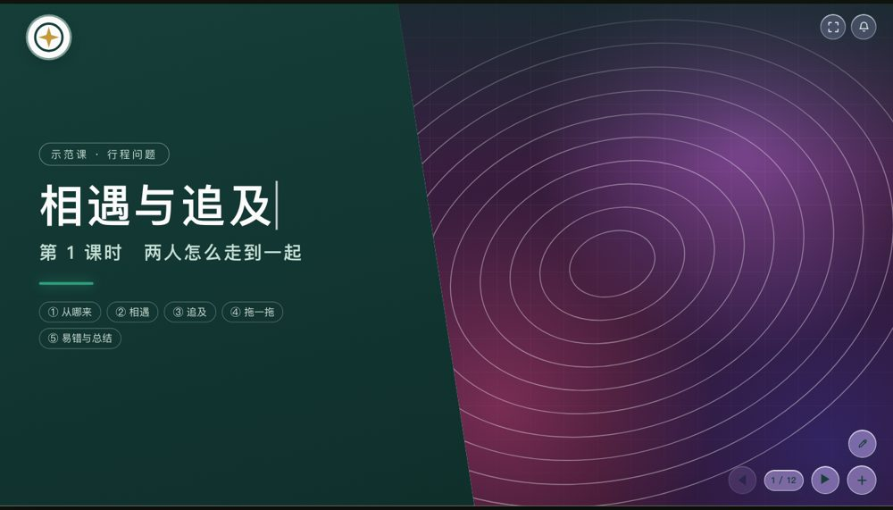
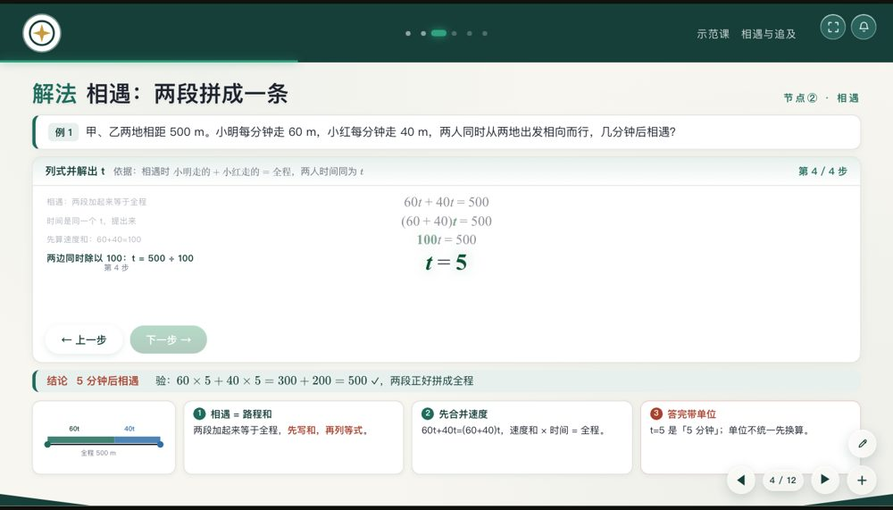
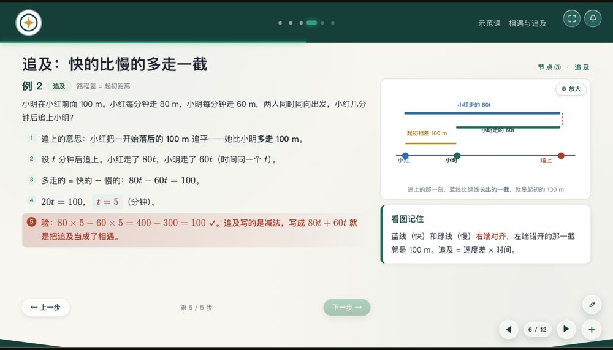
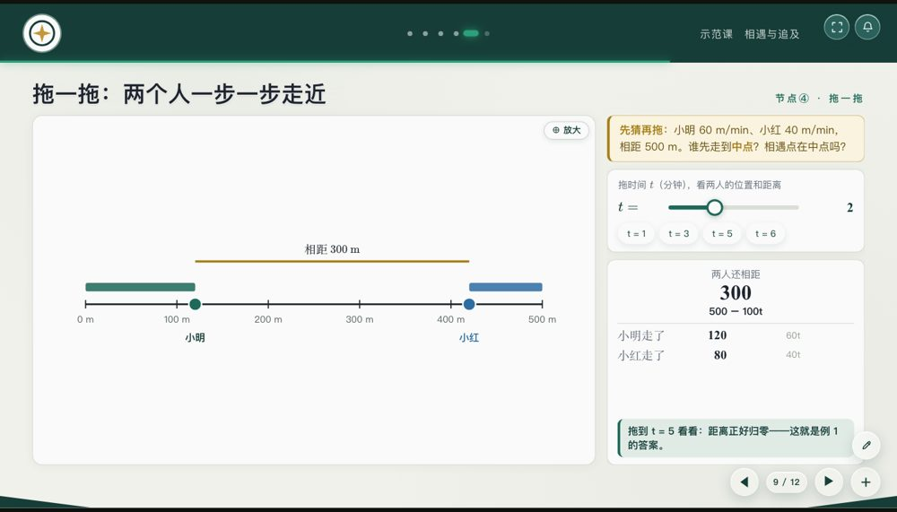
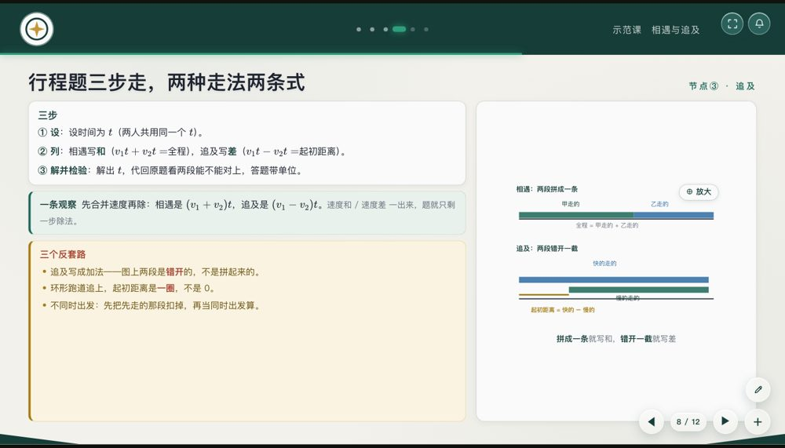
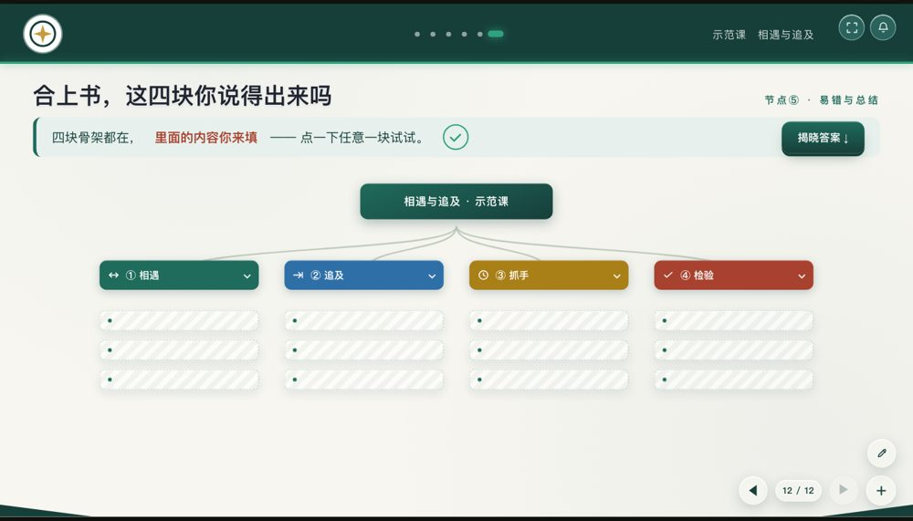
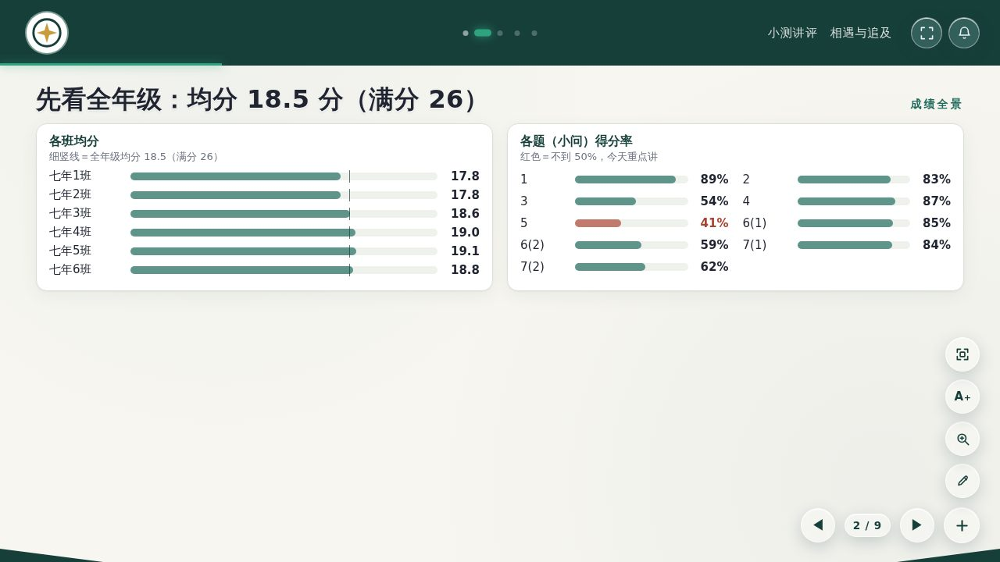
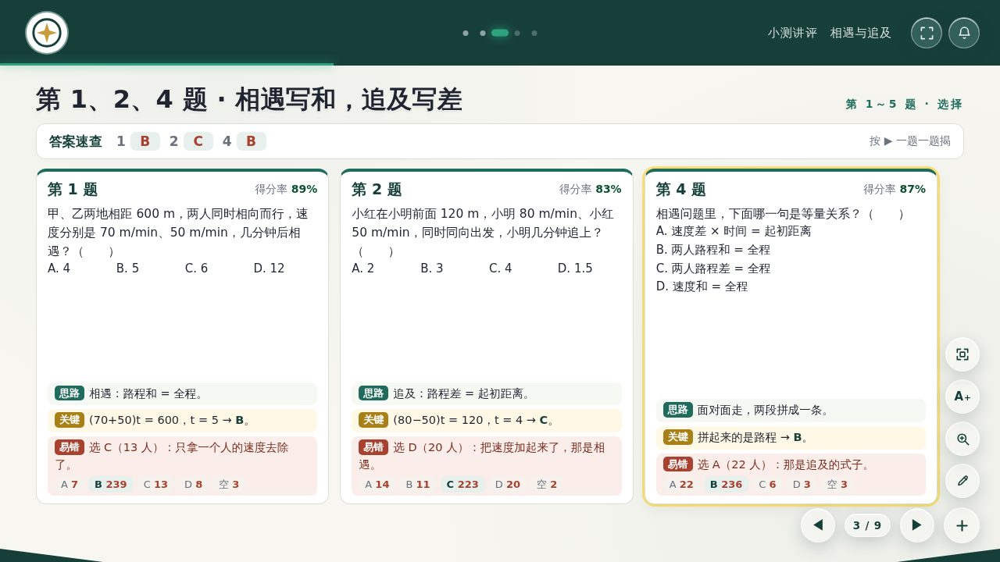
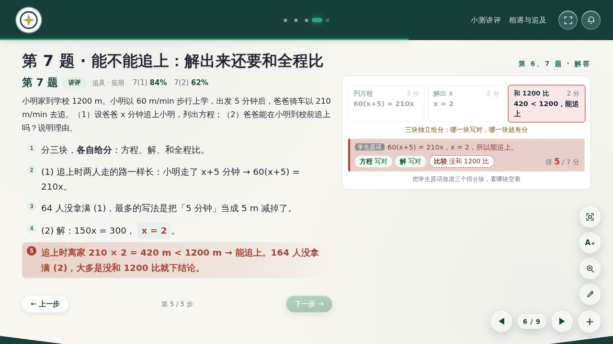
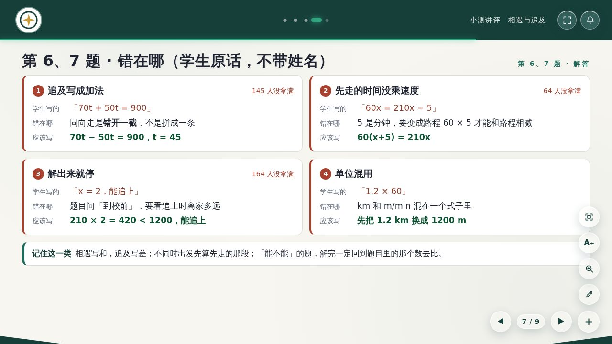

# Think like JC

**给 AI 智能体用的课件生产线（Skill）**：把一节课做成"一页页翻、带动效、投影用"的单文件 HTML 课件——可折叠思维导图、分步推导动效、习题步进讲解 + 图上高亮、滚轮计时器、滑条实验台、易错清单、笔迹板书、放大镜、大字档、点选放大、全屏、局部放大灯箱，断网可用。任何学科，五种课型：新授、训练、复习、应用，以及**练习 / 考试讲评课**（成绩全景、得分率、选项分布、本题错的人、错在哪、易错八处——所有数字从成绩表算）。

**A courseware production line for AI agents.** Turn one lesson into a single-file, offline HTML deck for the classroom projector: collapsible mind maps, step-by-step derivation motion, worked-example stepping with figure highlights, a wheel timer, slider labs, a pitfalls page, ink annotations, fullscreen and a zoom lightbox. Subject-agnostic.

<p align="center">
 <br>
 <br>
 
</p>

<p align="center">
 <br>
 <br>
<sub>示范讲评课（假数据）：成绩全景 · 速查卡 · 得分块 + 学生原话逐块判 · 错在哪</sub>
</p>

## 两条路 / Two tracks

| | Claude Code 路线（强模型） | 装配台路线（DeepSeek、千问等任何模型） |
|---|---|---|
| 模型写什么 | 页面 HTML + gen.py（`SKILL.md` 六步） | 纯文本「课件稿」（`studio/prompts/01-课件稿格式.md`） |
| 谁排版、谁检查 | `scripts/make.py` + `audit.py` | 装配台（单文件网页 / `TLJC.run` / `studio/cli.mjs`） |
| 场景 | 新授、训练、复习、应用、讲评 | 新授课、专题课、讲评课、微论坛、成绩分析报告 |
| 反馈 | 智能体自己看截图 | 装配台给出「修改意见」，原样发回模型，1–3 轮通过 |

**装配台路线三步**：`npm install && npm run build:studio` → 打开 `dist/课件装配台.html` → 右上角「提示词」复制给模型，把模型写的课件稿粘回来「装配并检查」。
学校平台自动调用见 `studio/prompts/README.md`；换本校品牌：`node studio/build.mjs --brand 品牌目录`。

成绩分析报告（均分 · 四率 · 标准差 · 分布 · 各班对比 · **梯度线达线**（有表才出）· 下山图 · 临界生冲/保 · 题目×班级**热力图** · 区分度 · 各班处方 · **历次走势与进退步**）全部由成绩表算出，模型只写四行设定。

## 它为什么能让弱模型也做对 / Why weak models still get it right

1. **骨架一字不动** — `assets/chassis/` 里是整个引擎（舞台等比缩放、翻页、章节 Dock、推导动效、思维导图、计时器、笔迹、放大镜、大字档、点选放大、全屏、灯箱）。智能体永远不改它。
2. **只填内容，不做判断** — 每种页型都有可复制的写法（`references/page-types.md`）；讲评课的人数、得分率由 `review_lib` 从成绩表现算，模型只写 `{6.B}` 这样的占位符，**一个数字都不用自己编**。
3. **一条命令、不绿不许交** — `scripts/make.py` 跑完 生成 → 静态检查（`lint.py`）→ 自动选包装配 → 构建 → 无头自检（`audit.py`：溢出、推导满幅、计时、导图、高亮孤儿键、标题折行、一页两个步进、名单隐私、图内文字压线出框、公式折行、固定按钮压内容、控制台报错）→ 逐页截图 → 目验清单。
4. **46 条踩坑账本 + 五科做法** — 每一条都是真实返工换来的（`references/pitfalls.md`）；化学、物理、语文、英语、历史讲评课的做法写成了照做清单（`references/subjects/`）。

## 从五节验收课件里学到了什么 / What was learned

2026-09 用 Opus 做的五科「九上 9 月练习讲评」课件（化学 23 页、物理 25 页、语文 27 页、英语 23 页、历史 30 页）逐页逆向，沉淀成：
- **第五种课型「练习讲评课」**（`references/review-lesson.md`）：骨架、每题讲法、数据分层、名单隐私五条、注释编号规矩；
- **讲评包** `--pack review`：成绩全景、速查卡、本题错的人、错在哪、得分块、文本图 + 跟题运镜、RD 原文逐题卡、对照表、分拣台、翻卡、勾选表……；
- **学科包**：`history`（真实比例年代轴、世纪算法 + 单元测试、Natural Earth 底图）、`chem`（装置零件库、表达式拼装台）、`physics`（分子模型、真实连杆内燃机）、`english`（单词卡、拼写对比）；
- **骨架升级**：放大镜、大字档、点选放大、触屏笔迹（老师 09-28 的建议）；
- **新闸门**：把五节课里「验收后仍残留」的问题（孤儿高亮键、标题折行、图内文字压线出框、按页改字号、压暗规则露出隐藏内容）都变成了自动检查——在原课件上重跑，能逐条复现。

## 用法 / Usage

**作为 Claude Code / Agent SDK 的 skill**：把本仓库放到 `~/.claude/skills/think-like-jc/`，对智能体说"把这份 PPT 做成课件"即可；智能体会按 `SKILL.md` 的六步走：先出结构提案让你确认 → 抽素材验答案 → 复制模板填 6 个文件 → 装配构建 → 自检 + 逐页目验 → 交付。

**手动跑一次示范课**：
```bash
cd think-like-jc && npm install katex && pip install playwright   # 一次（浏览器：playwright install chromium，或设 $CHROMIUM）
python3 scripts/make.py demo                                      # 新授示范课《相遇与追及》
cd demo/review && python3 make_fake_scores.py && python3 ../../scripts/review_data.py scores.fake.csv lesson/data.json && cd ../..
python3 scripts/make.py demo/review                               # 讲评示范课（假成绩）
node tests/test_packs.js                                          # 学科包纯函数单元测试
```
产物：`demo/*.html` 成品、`shots/` 逐页截图、`shots/CHECKLIST.md` 目验清单。
打开生成的 HTML 就是课件：◀ ▶ 翻页兼步进，右下角 + 号弹章节 Dock，笔迹钮画板书，右上角全屏与提示音。

## 换成你们学校的样子 / Branding

课件目录放一份 `brand.json`（六个字段全部可选）：机构名、校徽、格言、封面照片、署名、色板。给了就替换到同一位置；一样都不给就是默认版式——墨青色板、几何徽记、由课题名生成的封面画板。细节见 `references/brand-kit.md`。

## 目录 / Layout
```
SKILL.md                 智能体的照做清单（先按课型 × 学科路由）
references/              内容标准 · 视觉语言 · 交互动效 · 页型目录 · 课型骨架 · 讲评课 · 产线闸门 · 品牌卡 · 踩坑账本
references/subjects/     各科讲评做法：化学 · 物理 · 语文 · 英语 · 历史 · 数学
assets/chassis/          引擎骨架（不改）
assets/shared/           通用页型样式
assets/packs/            math · review · history · chem · physics · english
assets/lesson-template/  一课的起步模板（gen.py 新授类 / gen_review.py 讲评课，含 brand.json）
assets/brand/            品牌卡逻辑与默认徽记
scripts/                 make.py（一条命令）· lint.py · assemble.py · build.mjs · audit.py · review_data.py（成绩表 → data.json）
tests/                   学科包单元测试
demo/                    新授示范课《相遇与追及》（12 页）· demo/review 讲评示范课（9 页，假成绩）
```

## 许可 / License
MIT © JC. 示范课内容为原创；骨架内联的 KaTeX 遵循其自身 MIT 许可。
